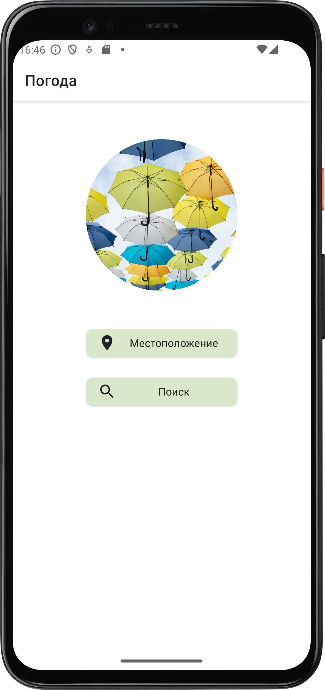
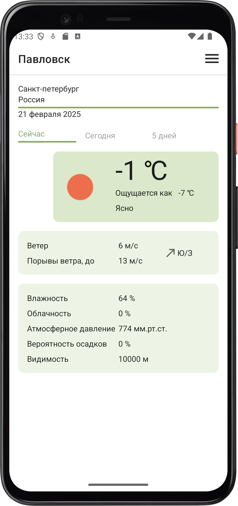
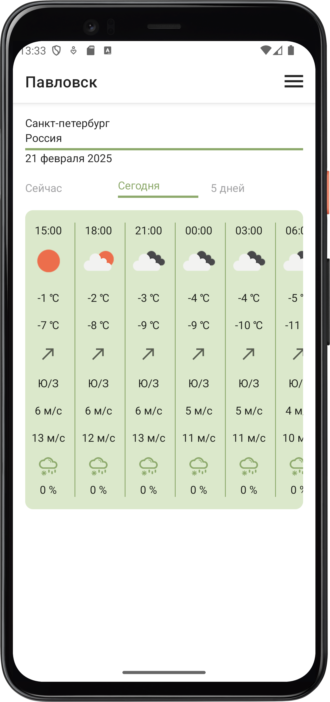
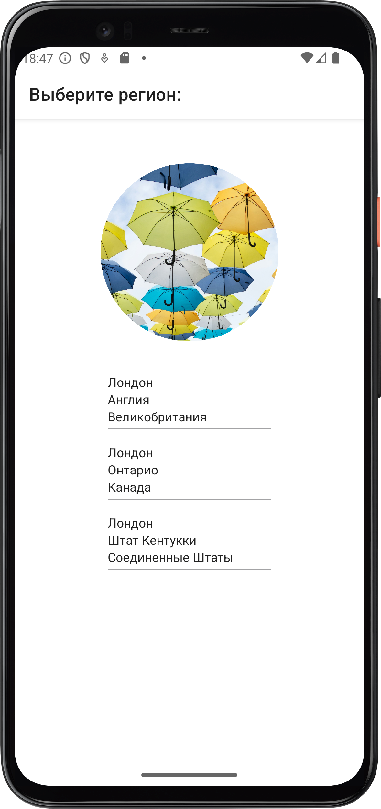
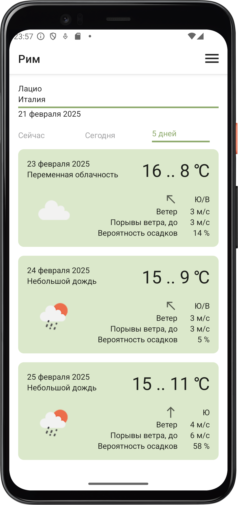
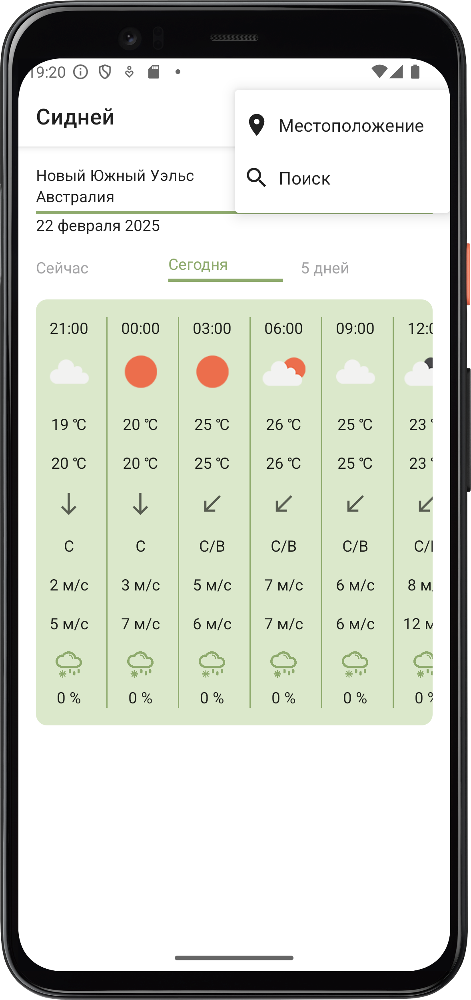
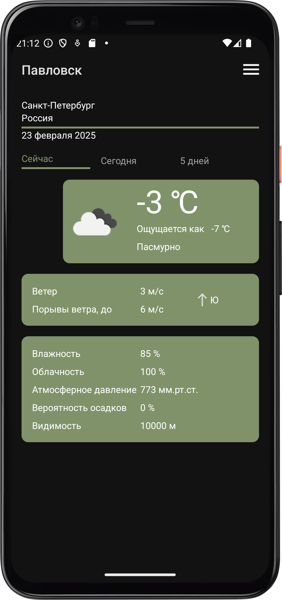
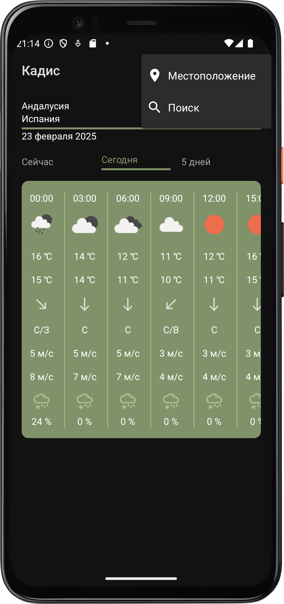
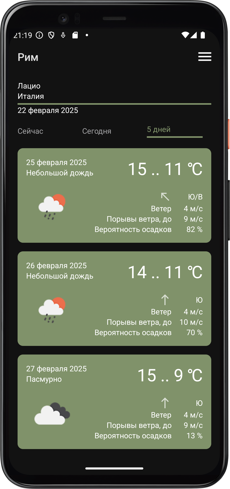

# Прогноз погоды 

Для получения данных приложение использует API [OpenWeather](https://openweathermap.org/API).  
При первом запуске приложение запрашивает доступ к данным о местоположении устройства, который необходимо предоставить для корректной работы всех функций приложения.

Первый экран приложения содержит 2 кнопки:
* Местоположение - ведет на основной экран приложения с прогнозом погоды для текущего местоположения устройства
* Поиск -  ведет на экран поиска по названию населенного пункта

Далее эти кнопки будут доступны в меню основного экрана приложения

## Основной экран приложения

Основной экран приложения содержит 3 вкладки:
* Сейчас - подробный прогноз на текущий момент
* Сегодня - прогноз на ближайшие 24 часа с интервалом в 3 часа
* 5 дней - краткий прогноз на ближайшие 5 дней
  

## Экран поиска

После ввода названия осуществляется переход на экран выбора региона со списком найденных населенных пунктов. По нажатию на название загружается основной экран приложения с прогнозом для выбранного населенного пункта.

Полученный прогноз сохраняется в локальную базу данных и при последующих запусках сразу открывается основной экран с обновленным прогнозом для последнего просмотренного пункта. В случае отсутствия доступа к интернету обновление не происходит.
 

## Темная тема

## Инструменты
* API: [OpenWeather](https://openweathermap.org/API)
* OkHttp
* Gson
* Room
* Dagger Hilt
* Google MLKit Translate
* Glide
* Coroutines
* Figma 
* java.time
